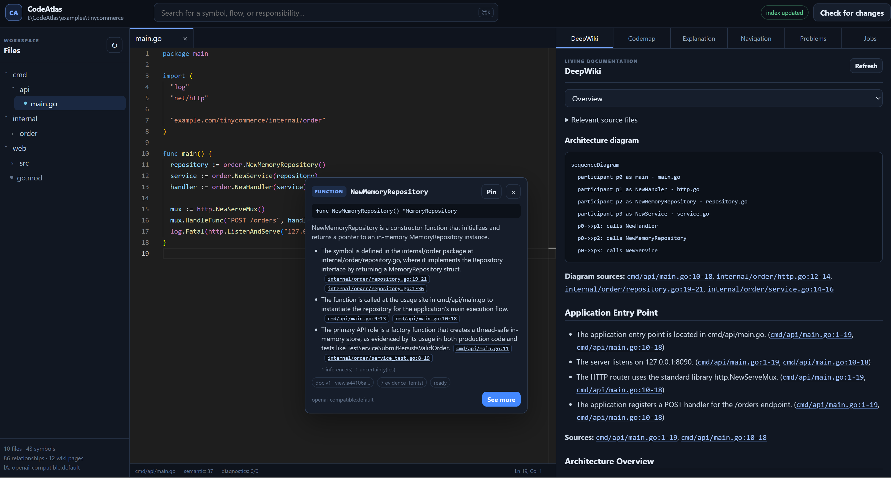

# CodeAtlas

[](https://github.com/ThalesMMS/CodeAtlas/actions/workflows/test.yml)
[](LICENSE)



CodeAtlas is a local-first code intelligence workspace with a Go backend and an embedded web editor. It builds a shared repository index for four connected experiences:

- **Hover Explain** for concise, evidence-backed symbol explanations.
- **See More** for callers, callees, evidence, and change-impact notes.
- **Codemaps** for query-driven architecture and execution-flow maps.
- **DeepWiki** for repository documentation generated from indexed code.

CodeAtlas combines deterministic Tree-sitter parsing, symbol and relationship graphs, BM25 retrieval, optional embeddings, and optional language-server evidence. Generated explanations require an OpenAI-compatible chat endpoint; CodeAtlas returns explicit errors when that provider is unavailable instead of inventing fallback prose.

> [!NOTE]
> CodeAtlas is an experimental developer tool. Review generated explanations and proposed changes before relying on them.

## Features

- Local workspace scanning, incremental indexing, and file watching.
- Monaco-based editing with versioned document overlays and safe saves.
- Grounded AI output with citations, inferences, uncertainties, and confidence metadata.
- Search across files, symbols, documentation, and structural relationships.
- Optional semantic evidence from `gopls`, `typescript-language-server`, `sourcekit-lsp`, `pyright-langserver`, and `rust-analyzer`.
- SQLite FTS5 storage and optional dense retrieval through an embeddings endpoint.
- Offline evaluation fixtures and browser-based end-to-end tests.

## Requirements

- Go 1.23 or newer.
- Node.js 26 or newer and npm 11.16.0 or newer, below npm 12.
- GNU Make and a POSIX-compatible shell for the provided `Makefile`.
- A C compiler available to cgo, such as Clang or GCC.
- An OpenAI-compatible `/chat/completions` endpoint.

Language servers and embeddings are optional. Their absence reduces semantic precision but does not disable deterministic AST indexing.

## Quick start

```bash
git clone https://github.com/ThalesMMS/CodeAtlas.git
cd CodeAtlas
cp .env.example .env
```

On PowerShell, copy the environment file with:

```powershell
Copy-Item .env.example .env
```

Edit `.env` with your provider URL, model, and API key, then run:

```bash
make frontend-install
make run
```

Open [http://127.0.0.1:8080](http://127.0.0.1:8080). By default, CodeAtlas loads the included `examples/tinycommerce` workspace.

To analyze another repository:

```bash
make run WORKSPACE=/absolute/path/to/your/repository
```

The server listens on `127.0.0.1:8080` by default. Override it with `LISTEN=host:port` or `CODEATLAS_LISTEN`.

### Build a native executable

The packaging scripts build the frontend, embed it in the Go server, create a
native executable for the current operating system, and run it in the
foreground. They are native builds rather than cross-compilers, installers, or
macOS application bundles.

On macOS, install the Xcode Command Line Tools if a C compiler is not already
available, then run:

```bash
xcode-select --install
bash ./build_package_and_run.sh
```

On Windows, install GCC or Clang for cgo, then run from Command Prompt or
PowerShell:

```powershell
.\build_package_and_run.cmd
```

Both scripts load unquoted `KEY=VALUE` assignments from `.env`, use
`examples/tinycommerce` when `CODEATLAS_WORKSPACE` is unset, and forward extra
arguments to CodeAtlas. For example:

```bash
bash ./build_package_and_run.sh -workspace /absolute/path/to/project -listen 127.0.0.1:9090
```

```powershell
.\build_package_and_run.cmd -workspace "C:\Code\project" -listen 127.0.0.1:9090
```

The resulting executable is `dist/codeatlas` on macOS and
`dist/codeatlas.exe` on Windows. Stop the foreground server with `Ctrl+C`.

## Configuration

The repository includes a documented [`.env.example`](.env.example). The main settings are:

| Variable | Required | Purpose |
|---|---:|---|
| `CODEATLAS_LLM_BASE_URL` | Yes | OpenAI-compatible API base URL, usually ending in `/v1`. |
| `CODEATLAS_LLM_MODEL` | Yes | Chat model name exposed by the provider. |
| `CODEATLAS_LLM_API_KEY` | Provider-dependent | Credential sent to the chat provider. |
| `CODEATLAS_LLM_REASONING_EFFORT` | No | Optional reasoning budget for See More, Codemap, and DeepWiki: `none`, `minimal`, `low`, `medium`, `high`, `xhigh`, or `max`; omitted for legacy providers. Hover always uses `none`. |
| `CODEATLAS_LLM_TIMEOUT` | No | Per-request timeout; defaults to `10m`. |
| `CODEATLAS_WORKSPACE` | No | Workspace to analyze; defaults to the included example. |
| `CODEATLAS_LISTEN` | No | HTTP listen address; defaults to `127.0.0.1:8080`. |
| `CODEATLAS_ENABLE_EMBEDDINGS` | No | Enables dense retrieval when set to `true`. |
| `CODEATLAS_EMBEDDING_MODEL` | With embeddings | Embedding model exposed by the provider. |
| `CODEATLAS_EMBEDDING_BASE_URL` | No | Separate embeddings endpoint; defaults to the chat base URL. |
| `CODEATLAS_EMBEDDINGS_API_KEY` | No | Separate embeddings credential; defaults to the chat credential. |

Hover explicitly sends `reasoning_effort: "none"` for low latency. When
reasoning is enabled for the other LLM features, CodeAtlas treats each
feature's output limit as the budget for the final validated answer. For
`minimal`, `low`, `medium`, `high`, and `xhigh`, it adds the gateway's default
reasoning reserve (256, 1,024, 4,096, 8,192, and 16,384 tokens respectively) to
`max_completion_tokens`. This prevents hidden reasoning from consuming the
answer budget. Gateways with custom `REASONING_EFFORT_BUDGETS` should keep those
values aligned; `max` has no separate bounded reserve.

Provider controls use `auto`, `true`, or `false`:

| Language | Enable variable | Executable variable | Default executable |
|---|---|---|---|
| Go | `CODEATLAS_GOPLS` | `CODEATLAS_GOPLS_PATH` | `gopls` |
| JavaScript / TypeScript | `CODEATLAS_TYPESCRIPT_LSP` | `CODEATLAS_TYPESCRIPT_LSP_PATH` | `typescript-language-server` |
| Swift | `CODEATLAS_SWIFT_LSP` | `CODEATLAS_SWIFT_LSP_PATH` | `sourcekit-lsp` |
| Python | `CODEATLAS_PYTHON_LSP` | `CODEATLAS_PYTHON_LSP_PATH` | `pyright-langserver` |
| Rust | `CODEATLAS_RUST_LSP` | `CODEATLAS_RUST_LSP_PATH` | `rust-analyzer` |

CodeAtlas does not install, update, or discover language servers automatically.

## Language support

| Language family | Extensions | Tree-sitter index | Editable overlay | Optional semantic provider |
|---|---|---:|---:|---|
| Go | `.go` | Yes | Yes | `gopls` |
| JavaScript | `.js`, `.mjs`, `.cjs`, `.jsx` | Yes | Yes | `typescript-language-server` |
| TypeScript | `.ts`, `.mts`, `.cts`, `.tsx` | Yes | Yes | `typescript-language-server` |
| Swift | `.swift` | Yes | Yes | `sourcekit-lsp` |
| Python | `.py` | Yes | Yes | `pyright-langserver` |
| Rust | `.rs` | Yes | Yes | `rust-analyzer` |

Project files such as `go.mod`, `package.json`, `tsconfig.json`, and Markdown files may be collected as bounded context, but they are not treated as editable source-language families.

## Repository layout

```text
CodeAtlas/
├── backend/            Go server, index, retrieval, storage, and AI services
├── frontend/           Embedded Monaco web application
├── e2e/                Playwright-based end-to-end test harness
├── eval/               Offline retrieval and output-quality evaluation
├── examples/           Example repositories used by tests and demos
├── .github/workflows/  Continuous integration workflows
├── Makefile            Development, build, test, and evaluation commands
└── LICENSE             GNU Affero General Public License v3
```

The frontend build writes hashed assets and `codeatlas-manifest.json` to `backend/internal/webui/dist/`. The Go binary embeds that directory, so run `make frontend-build` before invoking direct Go build or test commands.

## Development

Install frontend dependencies once:

```bash
make frontend-install
```

Common commands:

| Command | Description |
|---|---|
| `make run` | Build the frontend and start CodeAtlas. |
| `make build` | Build `dist/codeatlas`. |
| `make test` | Run frontend and Go tests. |
| `make check` | Run type checks, syntax checks, tests, repository verification, and `go vet`. |
| `make e2e` | Build the application and run the browser scenario suite. |
| `make e2e-budget` | Enforce the frontend bundle budget. |
| `make eval` | Run offline retrieval and output-quality gates. |
| `make fmt` | Format Go source files. |

The e2e harness uses a loopback fake OpenAI-compatible provider and a temporary copy of the example workspace. Generated reports are written under `e2e/reports/` and are ignored by Git.

Real language-server integration is opt-in because installed binaries and toolchains are machine-dependent. Set `CODEATLAS_TEST_REAL_LSP=1` before running the five `TestReal*` packages; the default suite uses deterministic protocol fakes.

## Privacy and safety

CodeAtlas reads the workspace path you explicitly configure. Source excerpts included in generated explanations are sent to the LLM or embeddings endpoints you configure, so review the provider's data-handling policy before analyzing private code.

The server binds to loopback by default. If you expose it on another interface, place it behind appropriate authentication and network controls. CodeAtlas does not install dependencies, run workspace scripts, invoke build systems, accept language-server workspace edits, or apply language-server commands.

Use [`.codeatlasignore`](.codeatlasignore) to exclude sensitive or irrelevant paths from indexing.

## Contributing

Issues and pull requests are welcome. Keep changes focused, add or update tests for behavior changes, and run the relevant checks before submitting a pull request.

## License

CodeAtlas is licensed under the [GNU Affero General Public License version 3](LICENSE), using the `AGPL-3.0-only` SPDX identifier.

See [THIRD_PARTY_NOTICES.md](THIRD_PARTY_NOTICES.md) for third-party components and their licenses.
